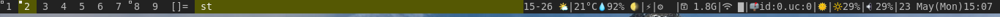

# lemonblocks
Modular status bar filler for window managers that use `WM_NAME` or stdin, e.g. [lemonbar](https://wiki.archlinux.org/index.php/Lemonbar) and [dwm](http://dwm.suckless.org/), written in c. This is project is the combination of [dwmblocks](https://github.com/torrinfail/dwmblocks) and [sslstatus](http://tools.suckless.org/slstatus).

Less is not always less. Several bar outputs are much faster if written in c instead of necessarily using external pipe commands. The implemented modules can be found in the `components/` folder.

Each block or component can have an individual update interval or an specific update signal. The `pkill -RTMIN+n lemonblocks` where n is the signal number specified in `blocks.h`. The whole configuration is made via the `blocks.h` file similarlly to dwmblocks, dwm and other suckless applications.

Use the flag `-p` in order to print to `stdout` otherwise the output is printed to `WM_NAME`.

## Built-in functions

### battery
`battery_perc(const char *)`
`battery_state(const char *)`
`battery_remaining(const char *)`

### cpu
`cpu_freq(void)`
`cpu_perc(int bar)`

### datetime
`datetime(const char *fmt)`

### disk
`disk_free(const char *path)`
`disk_perc(const char *path)`
`disk_total(const char *path)`
`disk_used(const char *path)`

### entropy
`entropy(void)`

### hostname
`hostname(void)`

### ip
`ipv4(const char *interface)`
`ipv6(const char *interface)`

### kernel_release
`kernel_release(void)`

### keyboard_indicators
`keyboard_indicators(void)`

### keymap
`keymap(void)`

### load_avg
`load_avg(void)`

### netspeeds
`netspeed_rx(const char *interface)`
`netspeed_tx(const char *interface)`

### num_files
`num_files(const char *path)`

### ram
`ram_free(char unit)`
`ram_perc(void)`
`ram_total(char unit)`
`ram_used(char unit)`

### run_command
`run_command(const char *cmd)`

### swap
`swap_free(void)`
`swap_perc(void)`
`swap_total(void)`
`swap_used(void)`

### temperature
`temp(const char *)`

### uptime
`uptime(void)`

### user
`gid(void)`
`username(void)`
`uid(void)`

### volume
`vol_perc(const char *card)`

### wifi
`wifi_perc(const char *interface)`
`wifi_perc_bar(const char *interface)`
`wifi_essid(const char *interface)`

### get output of file
`cat_file(const char *path)`

### BSPWM workspaces
`bspDesktops(void)`
