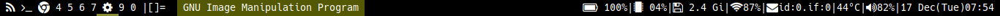

# lemonblocks
Modular status bar for lemonbar written in c.
# modifying blocks
The statusbar is made from text output from various in build functions
or external commands.
Blocks are added and removed by editing the blocks.h header file.

This was developed with [lemonbar](https://wiki.archlinux.org/index.php/Lemonbar) in mind but it just outputs text so it can be used with other bars.
